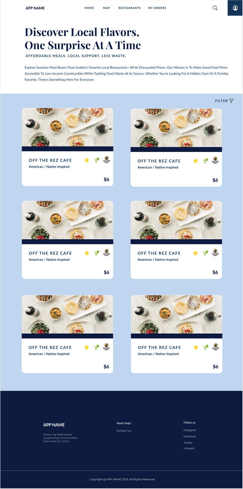

# Team Connecting
## Problem Statement

In under-resourced neighborhoods, especially those predominantly made up of Black, Brown, and immigrant families, access to fresh, affordable, and nutritious food is severely limited—not due to a lack of desire or awareness, but because of systemic racial and economic inequities (Burrell, 2022). 

Estimates indicate that **18.8 million people**, or **6.1% of the U.S. population**, reside in a food desert (U.S. Department of Agriculture [USDA], 2022). This issue, more accurately described as **food apartheid** rather than "food deserts," impacts individuals’ bodies, minds, and futures. Students affected by food apartheid often feel tired, sick, or distracted in class due to low-quality school meals or limited healthy options at home (Burrell, 2022). Over time, these conditions contribute to **chronic health issues** like diabetes and high blood pressure.

Structural inequities are further emphasized by research from the University of Michigan, which shows that communities of color—even those with similar poverty rates as white neighborhoods—face significantly **fewer supermarkets** and a **higher concentration of fast food outlets**, exacerbating poor health outcomes (Walker et al., 2023). Food-insecure adults and children also have higher rates of **mental health issues**, including depression, anxiety, and PTSD, and are at high risk for chronic diseases (Chilton, 2012). With **1 in 3 people globally** experiencing severe food insecurity (United Nations, 2023), the urgency to act is clear.

At the same time, **food waste** remains a massive and often overlooked issue in the U.S., particularly among large companies and organizations within the food supply chain. According to the USDA, **30–40% of the U.S. food supply**—around **133 billion pounds**—is wasted each year, equating to over **$161 billion** in losses (USDA, 2023). The environmental toll is equally staggering: food waste is the **largest contributor to landfill mass and methane emissions**, a greenhouse gas more than 25 times as potent as carbon dioxide (Environmental Protection Agency [EPA], 2023).

Large-scale food waste is driven by **overproduction**, **cosmetic standards**, and **logistical inefficiencies** in corporate and institutional systems. Supermarkets, restaurants, and food distributors often discard surplus edible food due to minor imperfections, inventory turnover, or misaligned demand forecasting. While some organizations donate leftovers, the infrastructure and incentives to do so effectively are lacking. In fact, ReFED reported that in 2023 alone, **food waste accounted for $338 billion** in lost food value (ReFED, 2023).

Existing solutions such as food waste reduction apps like **Too Good To Go**, meal planning tools, government assistance programs, and community gardens have made strides in addressing either food insecurity or food waste, but they fall short of fully resolving the problem—**particularly in under-resourced communities impacted by food apartheid**. Apps like Too Good To Go successfully reduce food waste and offer discounted meals, yet they often operate in **more affluent or urban areas** with dense commercial activity, limiting accessibility for marginalized neighborhoods (Vo-Thanh et al., 2021). 

Furthermore, despite the availability of **government programs** such as SNAP and food banks, food insecurity remains a widespread issue. According to the USDA (2023), approximately **1 in 20 people** in the United States still experience food insecurity, suggesting that existing interventions do not sufficiently address the **structural and systemic barriers** these communities face.

These dual challenges—**limited food access** and **widespread food waste**—are deeply connected. While some communities lack basic food access, others see organizations discarding surplus food due to systemic inefficiencies and rigid supply systems. **Team Connecting** seeks to address both crises by designing **equitable, user-centered solutions** that improve food access in marginalized communities while reducing organizational and systemic food waste.

---

## Solution Summary

**Team Connecting** aims to address the intersecting crises of **food waste** and **food apartheid** by designing an **equity-driven platform** that connects surplus meals from local restaurants to residents in under-resourced communities. 

Our digital solution is a **web-based platform** inspired by existing models like **Too Good To Go**, but intentionally built for **neighborhoods most impacted by systemic food injustice**, limited access to transportation, and nutritional disparities.

### Key Features:

- Users can **reserve discounted, healthy "mystery box" meals** from nearby restaurants at the end of the business day.
- Meals will account for **dietary restrictions** (e.g., halal, vegetarian, allergy-conscious) and **cultural food preferences** to ensure inclusivity and relevance.
- The platform will exclusively operate in areas **serviced by King County’s Metro Flex** — an on-demand, affordable transportation program, ensuring users have a way to pick up meals.

By leveraging **community-centered design** and **strategic transportation data**, our solution not only reduces food waste but also **redistributes food equitably** to those who need it most. This approach directly tackles structural inequities and reimagines **food recovery as a tool for justice, sustainability, and community wellbeing**.

## Design

### Home Page

The Home page introduces users to our mission of fighting food insecurity by connecting local restaurants with surplus meals to communities in need. This landing page features a short explanation of our initiative, current restaurant partners, and a visual highlight of featured mystery boxes.

Upon loading, users will see a clean layout that spotlights surprise box highlights and a “Explore Now” button, followed by a mission statement and about us. Scrolling further shows our featured partners.

**Figure 1: Home Page On First Load**  

Clicking on any featured restaurant takes users directly to that restaurant’s page, where they can learn more and place an order.

---

### Map Pages

The Map page is a stretch goal designed to provide an interactive way for users to discover participating restaurants. Each location is marked with a color-coded symbol indicating the level of food surplus available.

Upon page load, a map of Seattle appears, populated with clickable pinpoints. A filter button in the corner allows users to sort by cuisine type, dietary needs (vegan, gluten-free), and price range.

**Figure 2: Map Page On First Load**  

Clicking a pinpoint opens a preview popup with restaurant details and a button to view the full menu.

**Figure 2.1: Map Page With Restaurant Popup**  

When the user clicks on a pinpoint, a pop-up with detailed information about the restaurant appears. This includes the restaurant’s name, address, cuisine type, surplus food details, dietary options, and a button to place an order.

**Figure 2.2: Example Pop-Up**  

When the user clicks on a pinpoint, a pop-up appears with the restaurant's name, address, cuisine type, surplus food details, and available dietary options. An order button allows users to go to place their order. The pop-up provides essential information in a simple, accessible format.

---
### Restaurant Page

The restaurant page will show a list of nearby restaurant with food surplus. Users will be able to scroll down and see restaurants and their price, dietary restrictions and food type.

**Figure 3: RESTAURANT Page**

Users can choose restaurants and food they offer based on personal needs.

**Figure 3.1: RESTAURANT FILTER**

Users can filter restaurants to obtain results that match their preferences. The user has options to filter by dietary restrictions, price or by type of cuisine. It allows users to narrow down the restaurants that they need to look at before making a decision. 

**Figure 3.2: RESTAURANT POP UP**

This pop-up displays all information about the restaurant. It includes the restaurant name, a small about description,address, cuisine type, dietary options, pickup time, and a button to place an order.

**Figure 3.3: RESTAURANT ORDER CONFIRMATION**

This screen confirms that a user's restaurant order has been successfully placed. It provides key details such as the restaurant name and pick up time. 

---

### My Orders Pages

The My Orders page allows users to view and track their past and current orders. This page helps users keep track of the mystery boxes they’ve reserved, and easily access details about each order including restaurant information, pickup times, and dietary preferences. Users can also monitor the status of their orders and get any relevant details about their food.

Our stretch goal is to offer a feature that allows users to reorder from their past orders, depending on availability, as each restaurant’s offerings change daily.

When the page loads, the user’s current and past orders are displayed, showing each order's status, pickup details, and reservation information.

**Figure 4: My Orders Page On First Load**  
.png)

Upon clicking an order, users will see a detailed pop-up with information about their reserved food, including the restaurant name, the food items in the mystery box, pickup time, status, and location.

**Figure 4.1: Cancellation Warning Pop-Up**  
.png)

If a user tries to cancel their order, a warning message will pop up to confirm their action. The warning will state that once the order is canceled, it cannot be undone.

**Figure 4.2: Cancellation Confirmation**  

Once the user confirms the cancellation, a confirmation message will appear, letting the user know that their order has been successfully canceled.

**Figure 4.3: Unsuccessful Cancellation Error**  

If the cancellation is unsuccessful (for example, if the order is already being prepared or picked up), an error message will appear, letting the user know that the order was not canceled and to try again.

### Login and Sign-Up Pages

The Login and Sign-Up Pages are central to user access and account creation for the app. These pages allow users to either log in to their existing account or create a new one to begin exploring and using the app's features, such as reserving mystery boxes, tracking orders, and customizing their dietary preferences.

**Figure 5: Login Page on Initial Load**  

Upon successful login, users are directed to the Home Page, and the My Orders Page will be updated appropriately for each user.

**Figure 5.1: Sign-Up Page on Initial Load**  

Upon successful sign-up, the user will receive a confirmation email and will be redirected to the Home Page.

---

### My Account Page

The My Account page provides users with an overview of their profile and account settings. It allows users to view and manage personal information such as their name and email address. This centralized page improves the user experience by making it easy to edit profile details, log out, or delete the account. Our stretch goal is to enable users to personalize their account experience.

When the page loads, the user's profile information is displayed at the top, followed by action buttons at the bottom for logging out or deleting the account.

**Figure 6: My Account Page On First Load**  

### Included In All Pages

**Figure 7: Navigation Bar**  

- **[Home]** – Browse local restaurants with surplus food near you  
- **[Map]** – View locations and availability across Seattle  
- **[Restaurants]** – List of featured restaurants to order from  
- **[My Orders]** – Track and view your surprise boxes  
- **[Profile]** – Login/Sign-Up  

**Figure 8: Footer**  

Contains relevant details on our company like contact and socials. 
